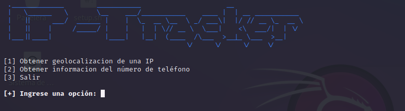
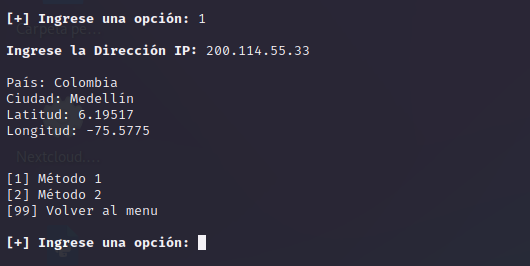
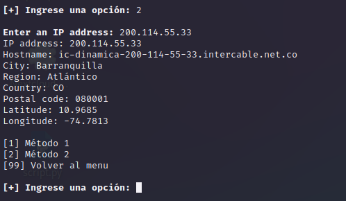

# IP-Tracker

<p align="center">

</p>

Herramienta avanzada de seguimiento y recopilacion de IP y número telefónico

```
git clone https://github.com/bl4ck44/IP-Tracker.git

cd IP-tracker

pip3 install -r requirements.txt

python3 tracker.py
```

<p align="center">

</p>

<p align="center">

</p>

<p align="center">

</p>

### ⚠️ **Aviso**

Este script ha sido desarrollado únicamente con fines **educativos y de investigación en ciberseguridad**.

No me responsabilizo del mal uso que se pueda dar ni de los daños que puedan ocasionarse por su ejecución.

El uso indebido de este material puede ser **ilegal**.